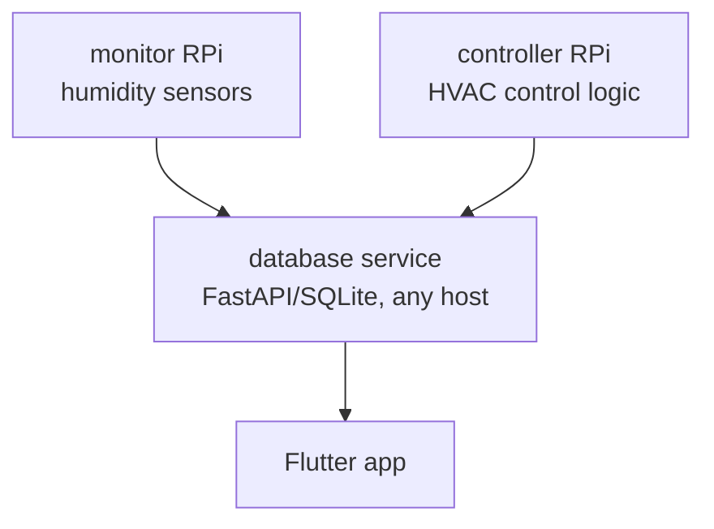

# air-marshall

A full-stack HVAC control system that monitors humidity and automates an AprilAire steam
humidifier. Two Raspberry Pi devices (one controller, one monitor) collect sensor data and
control hardware; a Flutter mobile app provides the UI; and a central database service stores
readings and events for the Flutter app to consume.

## Architecture



| Component | Description |
|---|---|
| `hvac_controller` | HVAC control logic — runs on the controller RPi |
| `monitor` | Environmental monitoring — runs on the monitor RPi |
| `database service` | FastAPI/SQLite HTTP service — stores sensor readings and HVAC state events |
| `app/` | Flutter mobile app — displays readings and status |

## Development setup

**Prerequisites:**

- Python 3.11+
- [uv](https://docs.astral.sh/uv/) — Python package manager
- Node.js 20+ — for markdownlint
- [Flutter SDK](https://docs.flutter.dev/get-started/install)

**Install dependencies and set up git hooks:**

```sh
uv sync --extra dev
pre-commit install --hook-type commit-msg --hook-type pre-commit
```

## Running tests

```sh
uv run pytest                                                      # Python unit tests
uv run pytest -m integration -v --no-cov --log-cli-level=INFO     # Python integration tests
cd app && flutter test                                             # Dart/Flutter unit tests
```

## Deployment

| Component | Docs |
|---|---|
| Database service | [docs/database.md](docs/database.md) |
| Flutter app | *(docs coming)* |
| Controller RPi | *(docs coming)* |
| Monitor RPi | *(docs coming)* |
